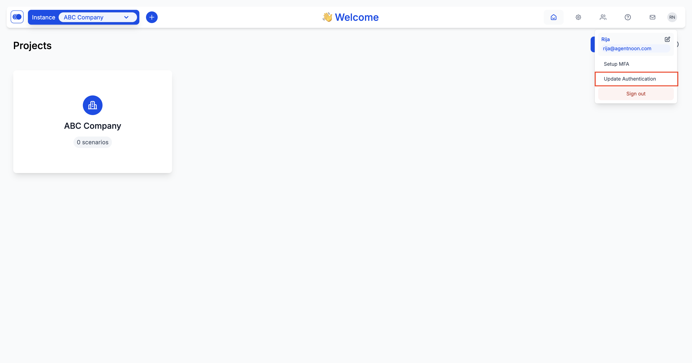
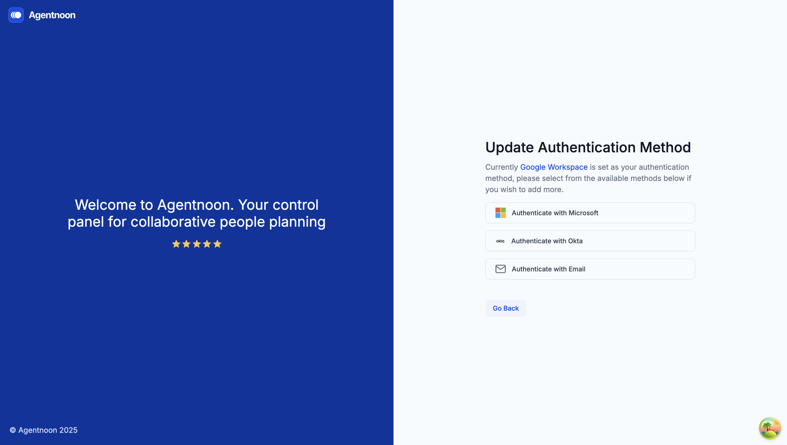
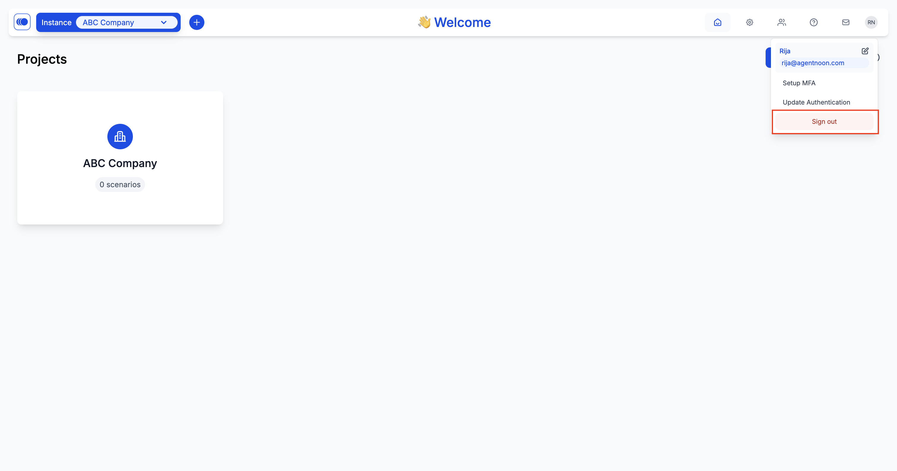

# Updating Login Method

### **Overview**

If you need to change how you log in, follow these steps to update your authentication method:

### Log in to Your Agentnoon Account

Sign in to Agentnoon as you normally would using your existing authentication provider (e.g., email, Google, or another SSO method).

### Open Your Profile Settings

* Click on your profile icon in the top right corner of the screen.
* A dropdown menu will appear.
* Select **"Update Authentication"** from the dropdown menu.

<figure><figcaption></figcaption></figure>

### Update Authentication Method

* A list of available authentication providers will be displayed.
* Choose a new login method from the list (e.g., switch from email/password to Google SSO).

<figure><figcaption></figcaption></figure>

### Complete the Setup

* Follow the instructions to set up your new login method.
* Once done, the system will take you back to the home page.

### Confirm Your New Login Method

* Open the profile menu again and select "Sign out".
* Now, sign back in using the newly selected authentication method to confirm the update.

<figure><figcaption></figcaption></figure>

Your login method is now updated! If you face any issues, contact support for assistance.
