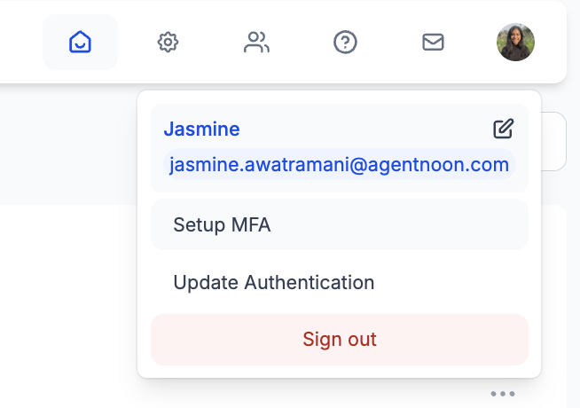

# In-App MFA

#### 1. Navigate to MFA Settings

1. Click on your profile name or email address in the top-right corner of the Agentnoon app.
2. From the dropdown menu, select **Setup MFA** to begin the enrollment process.

<figure><figcaption></figcaption></figure>

#### 2. Register Your Phone Number

1. Enter your phone number, including the appropriate country code.
   * _Tip: You can search for your country in the dropdown and then add your number._
2. Click **Send SMS** to receive a one-time verification code.
3. If you prefer to skip MFA setup for now, you can click **Skip**, but enabling MFA is highly recommended for your security.

<figure><figcaption></figcaption></figure>

**Note:** If you have enabled in-app Multi-Factor Authentication (MFA), there is currently no way for users to disable it themselves. Please contact _**support@agentnoon.com**_ to have it disabled on your behalf.
