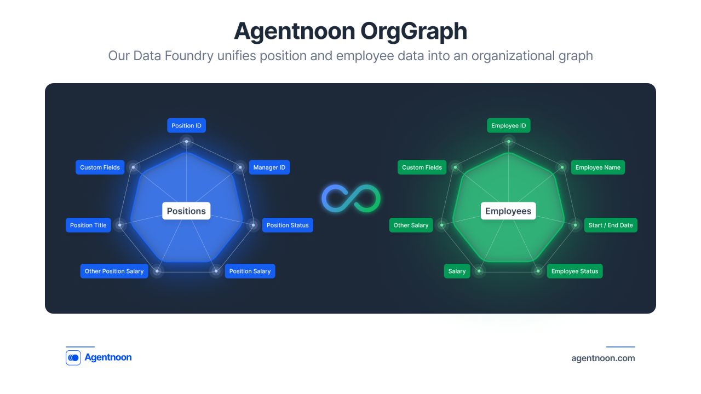
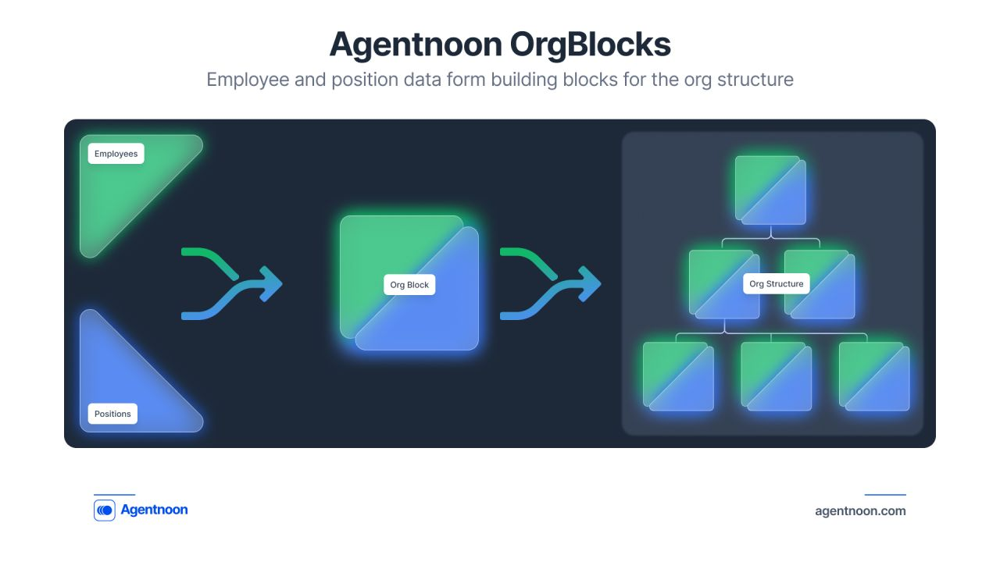

# Data Import

### Overview

This guide explains how to import data into Agentnoon, map attributes correctly, and distinguish between position and employee-level fields for accurate management.

#### 1. Uploading the File

1. Navigate to **Data Management → Import Data**.
2. Choose your file type (**Google Sheets or CSV**).
3. If using Google Sheets, paste the link.
4. Click **Upload** to begin processing the file.

_\*Note that if you are a Enterprise customer or SMB that has Integrations enabled, Agentnoon will set up a live integration to your data seperately as part of the onboarding process. This is for customers who want to do a flat file upload._

#### 2. Mapping Core Attributes

After uploading, you will need to map key fields:

1. **Position ID**: A unique identifier for each role.
2. **Manager’s Position ID**: Defines reporting relationships.
3. **Salary & Currency**: Select the relevant columns if you have multiple currencies. If not, you can set a default currency in **Settings**.

#### 3. Mapping Custom Fields

Custom fields allow flexibility in structuring your data.

* **Employee-Level Data**: Fields tied to an individual (e.g., Name, Birth Date).
* **Position-Level Data**: Fields tied to a role (e.g., Job Title, Department).
* **Start & End Dates**: Map these fields to track hiring and termination dates.

### Understanding Employee vs. Position Data

* When an **employee is attached** to a position, their **employee-level** data is added to the position.
* If an **employee is detached**, their **employee-level** data is removed, leaving only position-level details.
* If you **don’t need this distinction**, you can import everything as **custom fields** without separation.

<figure><figcaption></figcaption></figure> <figure><figcaption></figcaption></figure>

By correctly mapping attributes, you ensure accurate org visualization, talent selection, and workforce planning in Agentnoon.

## Visual Guide

> **[Screenshot placeholder: Data import interface showing upload button and file selection]**

> **[Screenshot placeholder: Field mapping interface matching CSV columns to Agentnoon fields]**

> **[Screenshot placeholder: Data validation results showing any errors or warnings]**

> **[Screenshot placeholder: Successful data import confirmation]**
