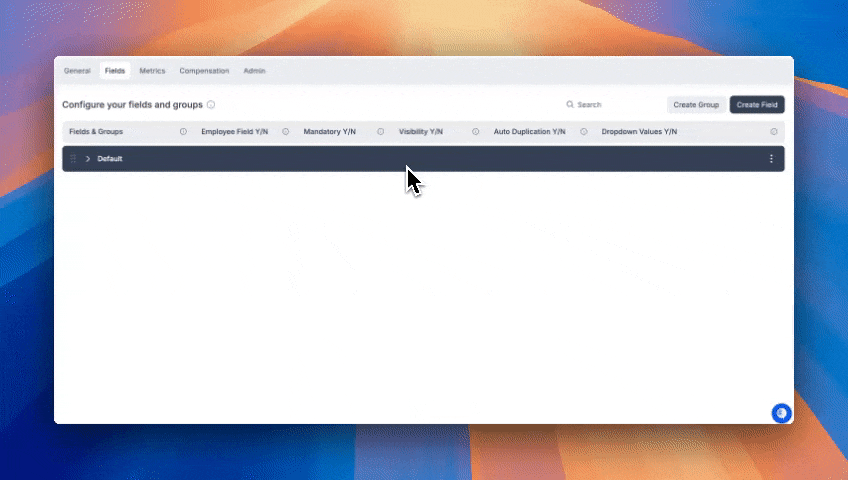
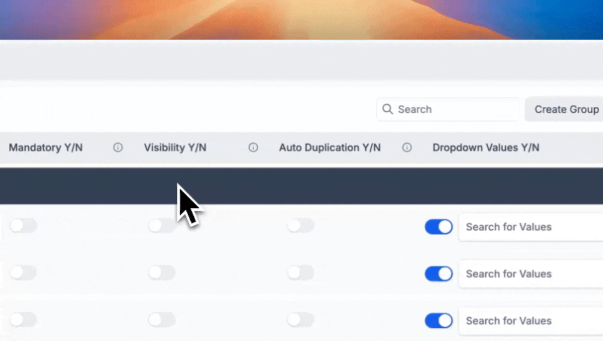
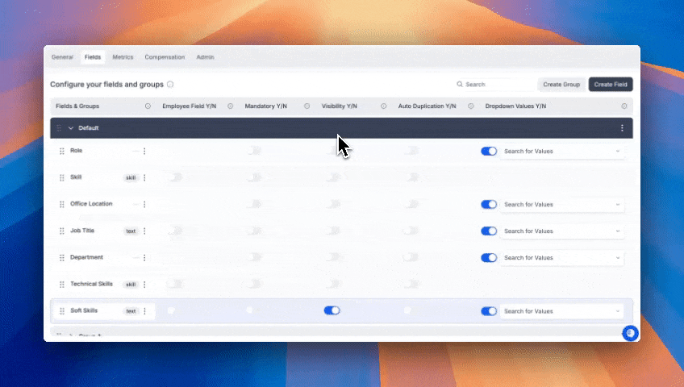

# Understanding Groups and Fields

### Overview

This guide introduces the core concepts of **Groups**, **Fields**, and how they work together to capture your organization's unique structure and attributes

#### 1. What are Groups?

**Groups** are categories used to organize related fields under a common heading. This helps maintain clarity and usability across Agentnoon, especially when managing complex organizational data.

<figure><figcaption>
Creating a Group
</figcaption></figure>

There are two primary types of groups:

* **People Groups**: Fields related to individuals, such as name, department, or location.
* **Position Groups**: Fields tied to a job position or role, such as job title, level, or compensation.

Each group acts as a section in forms, tables, and exports, providing a clear way to cluster similar information.

#### 2. What are Fields?

**Fields** are individual data points used to capture and store information in Agentnoon. Fields exist inside groups and represent a specific attribute.

<figure><figcaption>
Creating a Field
</figcaption></figure>

For example:

* In a **People Group**, you might have fields like `Preferred Name`, `Start Date`, or `Visa Status`.
* In a **Position Group**, fields might include `Base Salary`, `Job Family`, or `Location`.

Each field has its own data type (text, number, dropdown, etc.) and behavior.

#### 3. Position Fields vs. People Fields

Understanding the difference between **position** and **people** fields is crucial for accurate workforce planning:

* **Position Fields** are tied to job roles within the org chart and can exist independently of a person. This is useful for planning unfilled positions or viewing headcount budgets.
* **People Fields** are tied to employees. These fields capture personal or HR-specific data and disappear when the person is removed from the organization.

This separation allows organizations to plan, budget, and hire more effectively by managing roles and people independently.

#### 4. Ordering Fields

Field order determines how information is displayed in groups across Agentnoon (e.g., on the org chart, profile pages, and reports).

<figure><figcaption>
Ordering Fields
</figcaption></figure>

You can reorder fields within a group by:

* Dragging and dropping fields within the field settings UI
* Ensuring logical flow from top to bottom (e.g., Name → Department → Title → Location)

Well-ordered fields improve usability and reduce friction when entering or viewing data.

#### 5. Configuring Fields

Fields can be fully customized to fit your organizational needs. Here are the key configuration options:

* **Dropdown Options**: For fields like `Department` or `Job Family`, you can define a list of options users can choose from.
* **Visibility**:
  * _Public_: Visible to all users
  * _Restricted_: Visible only to selected roles or teams
* **Mandatory Settings**:
  * You can mark a field as required to ensure data completeness.
* **Data Types**: Choose from text, number, date, dropdown, user reference, and more.
